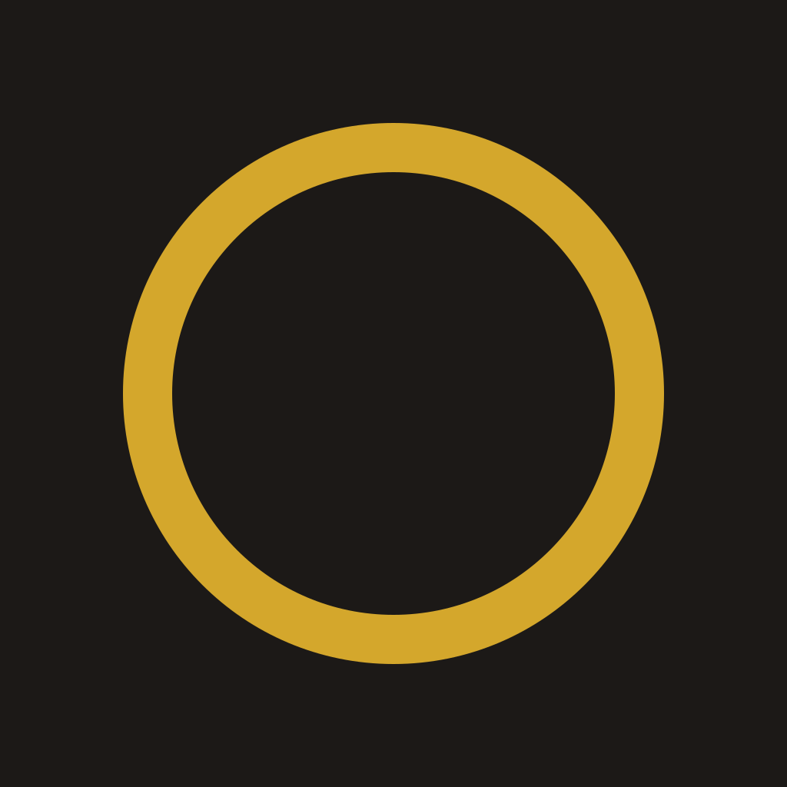

# nodaysidle

A minimal, privacy-focused web browser built with Electron.



## Features

- **Privacy-First**: Built-in ad blocker blocks trackers and ads
- **Minimal UI**: Clean, distraction-free interface
- **Tab Management**: Multiple tabs with keyboard shortcuts
- **Bookmarks & History**: Local SQLite storage, never synced
- **Dark Theme**: Easy on the eyes with warm amber accents

## Installation

### macOS

Download the latest `.dmg` from [Releases](https://github.com/salvadalba/nodaysidle-minimalbrowser/releases), open it, and drag nodaysidle to your Applications folder.

Or build from source:

```bash
git clone https://github.com/salvadalba/nodaysidle-minimalbrowser.git
cd nodaysidle-minimalbrowser
npm install
npm run build:mac
# App will be in dist/mac/nodaysidle.app
cp -r dist/mac/nodaysidle.app /Applications/
```

### Arch Linux

#### From AUR (coming soon)

```bash
yay -S nodaysidle
```

#### Build from source

```bash
# Install dependencies
sudo pacman -S nodejs npm git

# Clone and build
git clone https://github.com/salvadalba/nodaysidle-minimalbrowser.git
cd nodaysidle-minimalbrowser
npm install

# Build AppImage or pacman package
npm run build:linux

# Install AppImage
chmod +x dist/nodaysidle-*.AppImage
./dist/nodaysidle-*.AppImage

# Or install pacman package
sudo pacman -U dist/nodaysidle-*.pacman
```

#### Manual installation

```bash
git clone https://github.com/salvadalba/nodaysidle-minimalbrowser.git
cd nodaysidle-minimalbrowser
npm install
npm start
```

### Other Linux Distributions

```bash
git clone https://github.com/salvadalba/nodaysidle-minimalbrowser.git
cd nodaysidle-minimalbrowser
npm install
npm run build:linux
# Use the AppImage in dist/
```

## Development

```bash
# Clone the repo
git clone https://github.com/salvadalba/nodaysidle-minimalbrowser.git
cd nodaysidle-minimalbrowser

# Install dependencies
npm install

# Rebuild native modules for Electron
npx electron-rebuild

# Run in development mode (with DevTools)
npm run dev

# Run normally
npm start
```

## Keyboard Shortcuts

| Shortcut | Action |
|----------|--------|
| `Ctrl+T` | New Tab |
| `Ctrl+W` | Close Tab |
| `Ctrl+L` | Focus URL Bar |
| `Ctrl+B` | Toggle Sidebar |
| `Ctrl+R` | Reload Page |
| `Alt+Left` | Go Back |
| `Alt+Right` | Go Forward |

## Tech Stack

- **Electron** - Cross-platform desktop framework
- **BrowserView** - Embedded web content
- **better-sqlite3** - Local storage for bookmarks & history
- **Vanilla JS** - No frameworks, just clean code

## Project Structure

```
nodaysidle-minimalbrowser/
├── electron/
│   ├── main.js       # Main process, window & BrowserView
│   ├── preload.js    # IPC bridge
│   ├── database.js   # SQLite for bookmarks/history
│   └── tabs.js       # Tab state management
├── src/
│   ├── index.html    # UI markup
│   ├── styles.css    # Dark theme styles
│   └── main.js       # Renderer process
├── build/
│   ├── icon.svg      # Logo source
│   ├── icon.icns     # macOS icon
│   └── icon.png      # Linux icon
└── package.json
```

## License

MIT

---

*made with no days idle*
